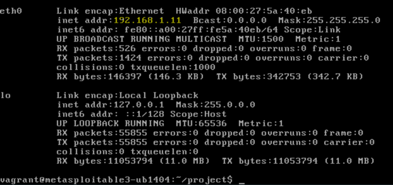
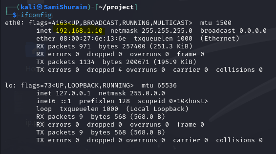
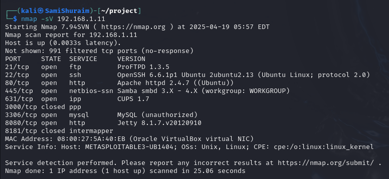
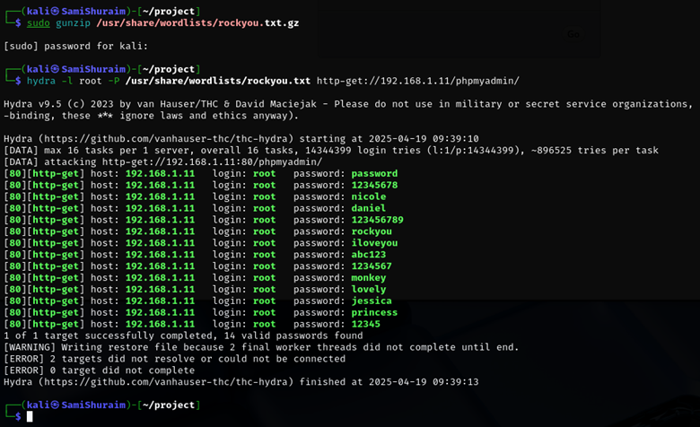
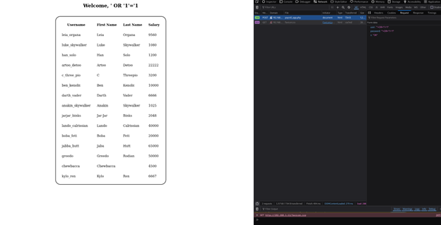
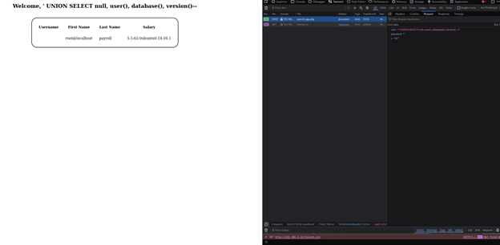
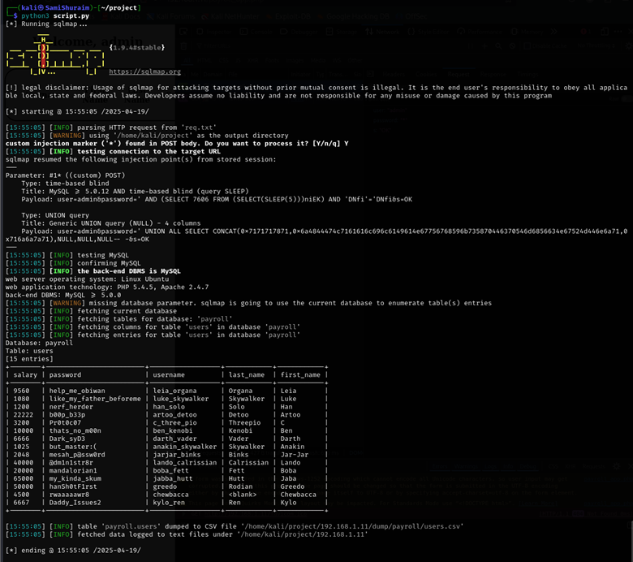

# ICS344 - Exploit and Compromise Phase (Phase 1)

## Introduction
This document covers Phase 1 of the ICS344 project, where the goal was to exploit a vulnerable service on the Metasploitable3 machine, extract data from its database, and automate the process using tools like sqlmap. This phase involved using various penetration testing techniques to exploit a vulnerable MySQL service accessible **via** an HTTP server and dump sensitive data from the victim machine.

## Tools Used
- **Metasploitable3**: A vulnerable VM used as the victim machine.
- **sqlmap**: An automated tool used to perform SQL injection and extract data from a vulnerable MySQL service.
- **Hydra**: A tool for brute-force password cracking.
- **Python**: A script (linked below) was developed to automate the process of running sqlmap and displaying the dumped data.

## Phase 1 Steps

### 1. Setting Up Metasploitable3
The first step is to set up Metasploitable3, which is a purposely vulnerable machine. Once the victim machine is booted up, we find its IP address using commands like ifconfig or through the virtualization tool. The target machine's IP address is 192.168.1.11.



### 2. Updating Kali Packages
Before proceeding with the attack, it's essential to update Kali Linux to ensure all tools, including sqlmap, are up to date. This is done by running:

```bash
sudo apt update
sudo apt upgrade -y
```



### 3. Nmap Scan of Services
We then perform a Nmap scan on the Metasploitable3 machine to identify the open ports and services. This helps us identify vulnerable services like MySQL (potentially exposed via HTTP), Apache, and PHPMyAdmin that we can investigate further.

```bash
nmap -sV 192.168.1.11
```



### 4. Using Hydra to Find Valid Usernames and Passwords
Next, we run Hydra to attempt cracking valid usernames and passwords for the web service exposing the MySQL database. This brute-force attack uses a list of potential passwords to find valid combinations needed for tools like sqlmap.



### 5. SQL Injection via Web Interface
At this point, we perform an SQL injection attack targeting the MySQL database **via** the vulnerable web interface. By using sqlmap with the appropriate parameters (like the URL and potentially credentials found by Hydra), we can exploit the SQL vulnerability to gain access to the MySQL database. This allows us to view all user data, including first names, last names, and salaries.



### 6. Finding Root User and Database Information
Further, we use SQL injection to gather additional important information about the MySQL service, such as the root username, the current database name, and the version of MySQL. The payload used for this is:

```sql
' UNION SELECT null, user(), database(), version()--
```

This query retrieves the root username, database name, and MySQL version (or possibly operating system details).



### 7. Automating the Process with sqlmap
The process of exploiting the vulnerable MySQL service **via** HTTP is automated using a Python script (linked below). The script runs sqlmap, automates the exploitation, and dumps the data directly to the terminal.

Link to Python Script: [script.py](script.py)



## Phase 1 Conclusion
In this phase, we successfully exploited a vulnerable **MySQL service via HTTP** on the Metasploitable3 machine. By using SQL injection, we were able to bypass authentication, dump sensitive data (user names, salaries, etc.), and automate the process using sqlmap. This lays the foundation for further analysis and defensive strategies in the next phase of the project.