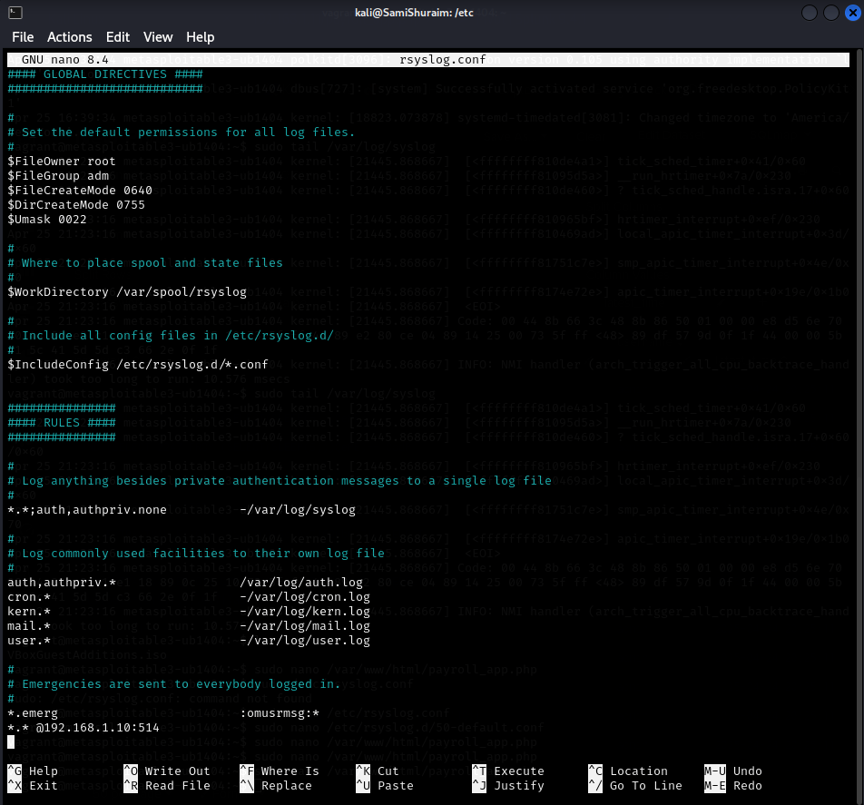
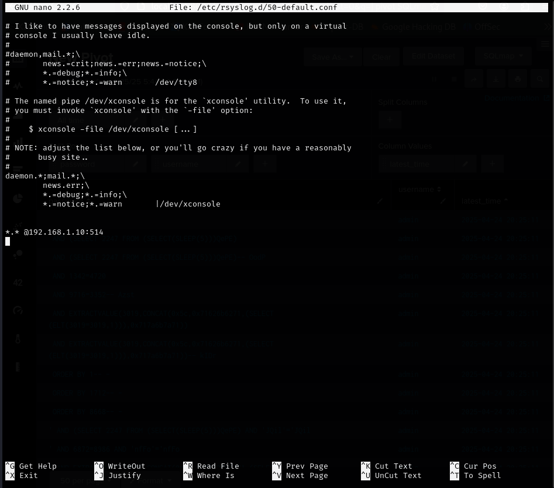
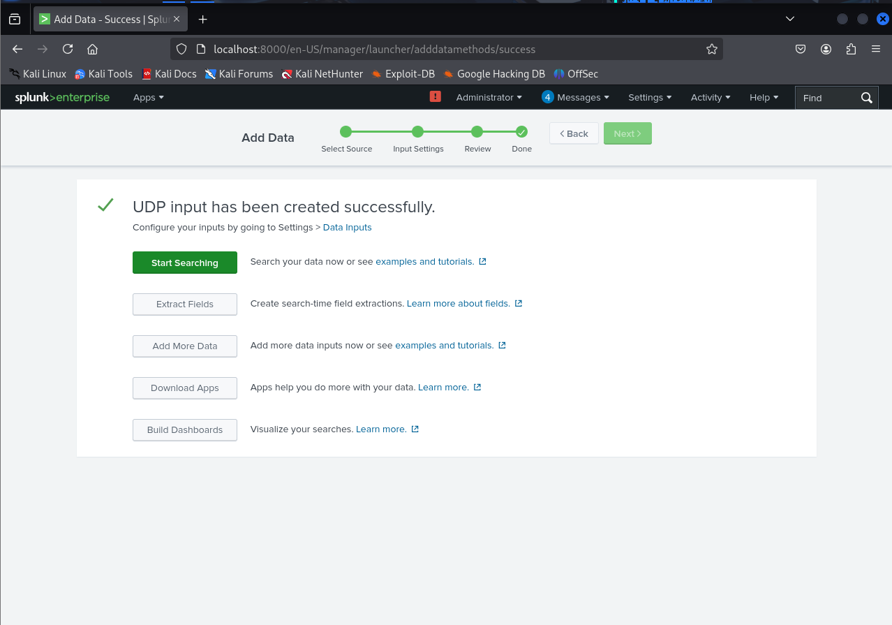
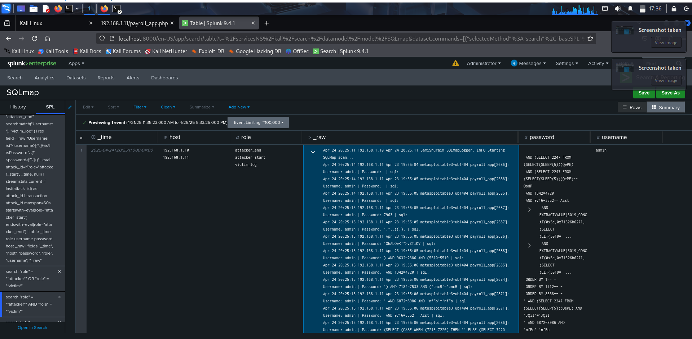
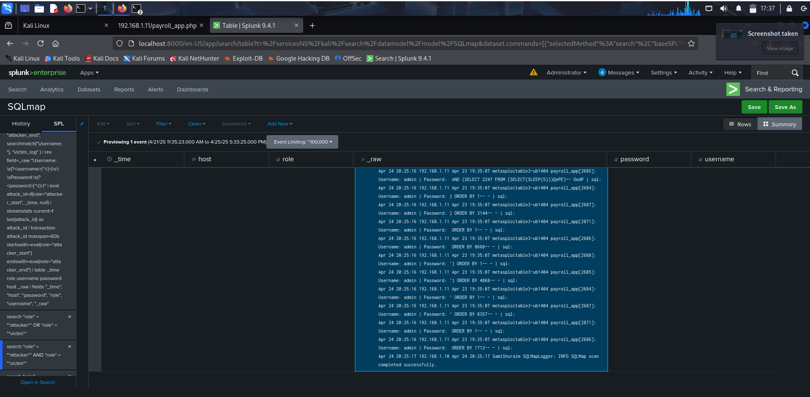
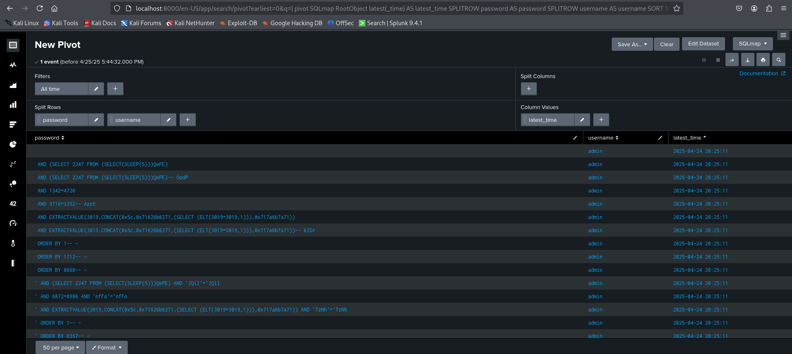

# ICS344 - Security Information and Event Management (SIEM) Phase (Phase 2)

## Introduction
This document covers Phase 2 of the ICS344 project, focusing on Security Information and Event Management (SIEM). The goal is to integrate logs from both the victim (Metasploitable3) and attacker (Kali Linux) machines into a SIEM tool (Splunk) to visualize, analyze, and understand the attack patterns observed in Phase 1.

## Tools Used
- **Metasploitable3**: The victim machine generating logs.
- **Kali Linux**: The attacker machine generating logs.
- **Splunk**: The SIEM tool used for log aggregation, analysis, and visualization.
- **Rsyslog**: Used to forward logs from both machines to Splunk.

## Phase 2 Steps

### 1. SIEM Integration Setup
The first step involves configuring log forwarding from both the attacker and victim machines to the Splunk instance. This was achieved using `rsyslog`. Splunk was configured with a UDP data input to receive these logs.

- **Victim & Attacker Log Forwarding (rsyslog):** Configuration files on both machines were modified to send relevant logs (e.g., auth logs, web server logs) to the Splunk server's IP address and designated UDP port.

- **Splunk UDP Input:** A UDP input was configured in Splunk to listen for incoming logs on the specified port.

### 2. Log Analysis and Visualization
With logs aggregated in Splunk, we analyzed the sequence of the sqlmap attack from Phase 1 by correlating logs from both the attacker and victim machines.

- **Identifying SQLmap Activity:** Splunk searches were used to pinpoint key events:
    - An attacker log entry indicating the start of the sqlmap table dump.
    - Victim log entries showing the specific usernames and passwords sqlmap attempted during the attack.
    - An attacker log entry confirming the completion of the sqlmap attack.

These correlated events demonstrate the ability of the SIEM to reconstruct the attack timeline using data from multiple sources.

## Phase 2 Conclusion
In this phase, logs from the attacker and victim machines were successfully integrated into Splunk using `rsyslog`. By analyzing these logs, we reconstructed the timeline of the sqlmap attack performed in Phase 1, identifying the start, execution (including specific credential attempts), and end phases through correlated log entries. This demonstrates the value of SIEM in correlating events from different sources to understand and investigate security incidents.
