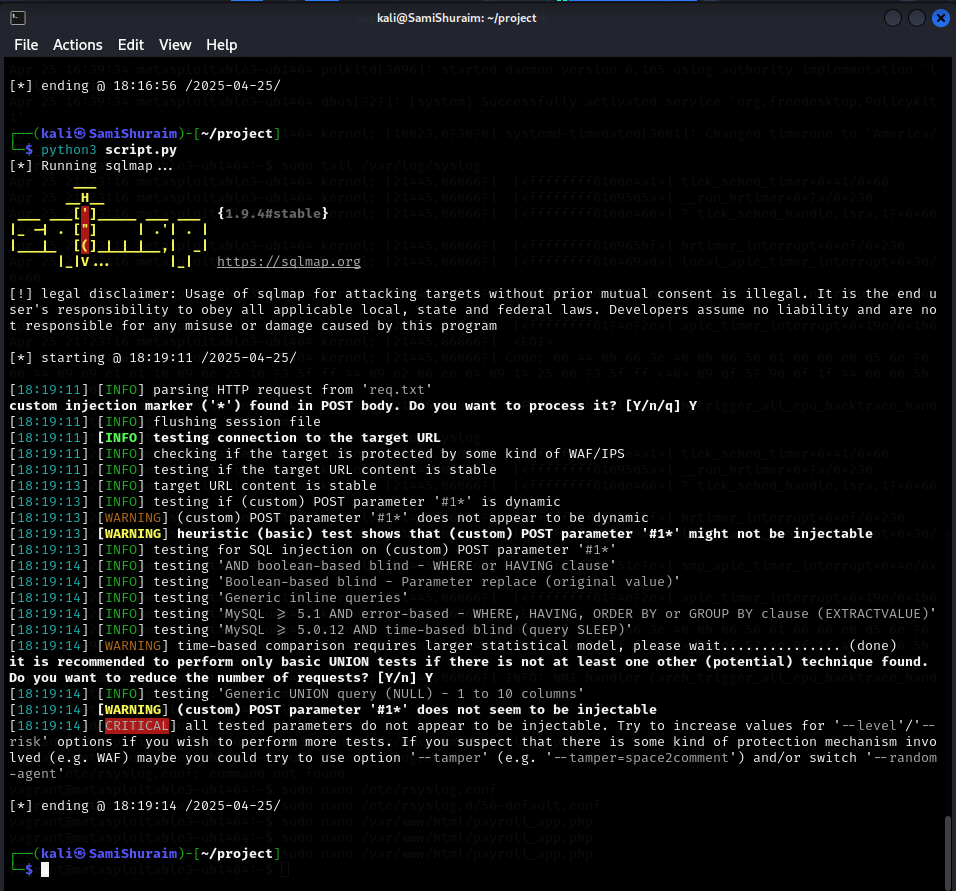

# ICS344 - Defense Implementation and Validation (Phase 3)

## Introduction
This document details Phase 3 of the ICS344 project, focusing on implementing and validating a defense mechanism against the SQL injection vulnerability identified in Phase 1 and analyzed in Phase 2. The goal is to modify the vulnerable application code and demonstrate the effectiveness of the defense against the previously successful `sqlmap` attack.

## Identified Vulnerability
The web application (`/var/www/html/payroll_app.php` on Metasploitable3) was vulnerable to SQL injection. This vulnerability stemmed from directly incorporating user-provided input (`user` and `password` parameters) into the SQL query string without proper sanitization or parameterization, as seen in the original code:

```php
// Vulnerable code snippet from phase 3/payroll_app.php (before fix)
// Note: $enable_sanitization would be false here in the vulnerable state.
$user = $_POST['user'];
$pass = $_POST['password'];
$stmt = "SELECT username, first_name, last_name, salary FROM users WHERE username = '$user' AND password = '$pass'";
$result = mysqli_query($conn, $stmt);
```

This allowed an attacker using tools like `sqlmap`, potentially automated via a script like `phase 2/script.py`, to manipulate the query, bypass authentication, and extract sensitive data (like the contents of the `users` table) directly from the database.

## Defense Mechanism: Prepared Statements
To mitigate this SQL injection vulnerability, the `phase 3/payroll_app.php` code was modified to use **prepared statements** with parameter binding. This approach separates the SQL query structure from the user-supplied data. The database compiles the query template first, and then the user input is supplied as parameters, preventing it from being interpreted as executable SQL code.

- **Code Modification:** The PHP code in `phase 3/payroll_app.php` was updated to utilize `mysqli` prepared statements:

```php
// Secure code snippet from phase 3/payroll_app.php (after fix)
// Note: $enable_sanitization is true here.
$user = $_POST['user'];
$pass = $_POST['password'];
$stmt = mysqli_prepare($conn, "SELECT username, first_name, last_name, salary FROM users WHERE username = ? AND password = ?");
mysqli_stmt_bind_param($stmt, "ss", $user, $pass);
mysqli_stmt_execute($stmt);
$result = mysqli_stmt_get_result($stmt);
```


## Testing & Validation
To validate the effectiveness of the implemented defense, the original attack, executed using the `phase 2/script.py` which utilizes `sqlmap` against the modified `phase 3/payroll_app.php`.

## Before-and-After Comparison

- **Before Defense:** The `sqlmap` attack was successful, bypassing authentication and dumping the contents of the `users` table from the `payroll` database.


- **After Defense:** After applying the prepared statements fix in `phase 3/payroll_app.php`, the *exact same* attack script (`phase 2/script.py`) was executed. This time, `sqlmap` failed to identify or exploit any SQL injection vulnerabilities. The database query, now parameterized, correctly treated the malicious input as literal strings rather than SQL commands, preventing the data exfiltration.



## Phase 3 Conclusion
In this phase, the critical SQL injection vulnerability in `phase 3/payroll_app.php` was addressed by refactoring the application code to use prepared statements. Validation through rerunning the `sqlmap` attack via `phase 2/script.py` confirmed the effectiveness of this defense mechanism. The before-and-after comparison clearly demonstrates that parameterized queries successfully mitigated the vulnerability, preventing unauthorized database access and data leakage. This highlights the importance of secure coding practices, specifically input validation and the use of prepared statements, in defending against SQL injection attacks.
